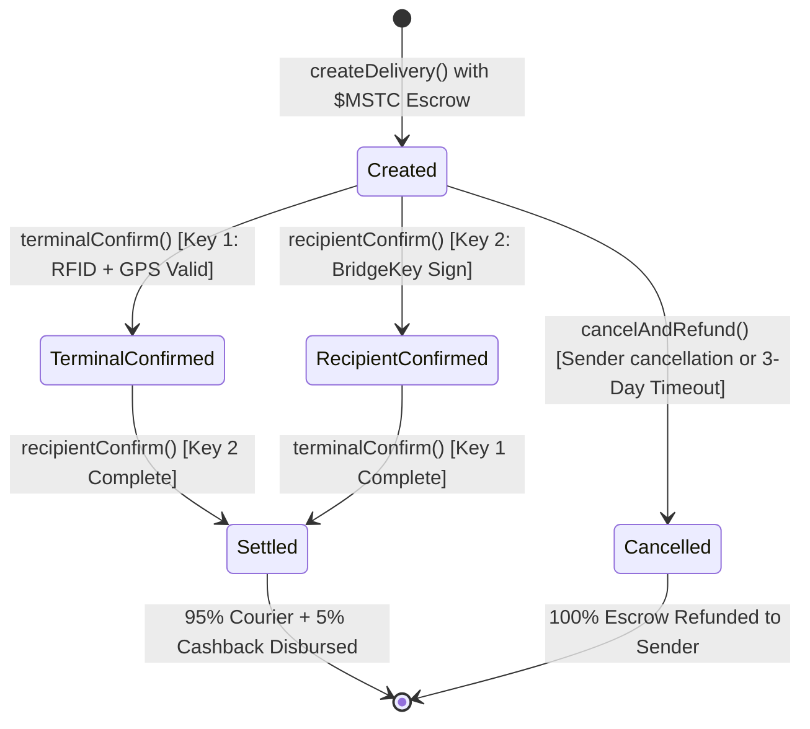

# 📦 Blockchain-Verified Smart Delivery Terminal

<div align="center">


**Two-Factor Multi-Signature IoT Escrow with On-Chain GPS Geofencing, Physical RFID Verification & Automated Cash-on-Delivery (COD) Replacement**

[🌐 Live DApp](https://mst-sandy.vercel.app) • [🤖 Telegram Bot (@Mst_Smart_Terminal_bot)](https://t.me/Mst_Smart_Terminal_bot) • [📜 Verified Contract on MSTScan](https://testnet.mstscan.com/address/0x7b86F2a24306b246e823d698815DCE356A9CBadF) • [📂 GitHub Repository](https://github.com/imagine1phoenix/MST)

---

### 🏆 MST Blockchain Buildathon | MST × Robotics Track
**Document & Release Version:** `v3.0.0` • **Target Network:** `MST Testnet (Chain ID: 91562037)`

</div>

---

## 📑 Table of Contents

1. [🌟 Executive Summary & Problem Statement](#-executive-summary--problem-statement)
2. [🔑 The Two-Factor Multi-Sig (Multi-Sig) Mechanism](#-the-two-factor-multi-sig-multisig-mechanism)
3. [🌐 Live Deployments & Verified On-Chain Proof](#-live-deployments--verified-on-chain-proof)
4. [🏗️ End-to-End System Architecture](#️-end-to-end-system-architecture)
5. [📜 Smart Contract Deep Dive (`MultiSigDelivery.sol`)](#-smart-contract-deep-dive-multisigdelivery)
   - [State Machine & Lifecycle](#state-machine--lifecycle)
   - [On-Chain Equirectangular GPS Geofencing Math](#on-chain-equirectangular-gps-geofencing-math)
   - [5% Cashback & 95% Courier Payout Flywheel](#5-cashback--95-courier-payout-flywheel)
6. [🤖 Physical Hardware & Firmware (`Newrro Neurick ESP32-S3 + STM32`)](#-physical-hardware--firmware-newrro-neurick-esp32-s3--stm32)
   - [Dual-MCU Architecture](#dual-mcu-architecture)
   - [Sensors & Actuators](#sensors--actuators)
   - [Complete Pinout & Electrical Wiring Table](#complete-pinout--electrical-wiring-table)
   - [Non-Blocking Scheduling & Firmware Loop](#non-blocking-scheduling--firmware-loop)
7. [📡 Node.js Relay Server & Autonomous Event Engine (`/relay`)](#-nodejs-relay-server--autonomous-event-engine-relay)
   - [Relay Architecture & Features](#relay-architecture--features)
   - [API Endpoint Specification](#api-endpoint-specification)
   - [Autonomous On-Chain Settlement Monitor](#autonomous-on-chain-settlement-monitor)
8. [💬 Official Telegram Bot (`@Mst_Smart_Terminal_bot`)](#-official-telegram-bot-mst_smart_terminal_bot)
   - [Key Features & Commands](#key-features--commands)
   - [Live Notification Message Flows](#live-notification-message-flows)
9. [💻 Web3 Frontend DApp (`/frontend`)](#-web3-frontend-dapp-frontend)
   - [Design System & Cyberpunk Theme](#design-system--cyberpunk-theme)
   - [Portal 1: Sender Escrow Booking](#portal-1-sender-escrow-booking)
   - [Portal 2: Recipient Two-Factor Multi-Sig Portal](#portal-2-recipient-two-factor-multi-sig-portal)
   - [Portal 3: Terminal Hardware Monitor & Live Simulator](#portal-3-terminal-hardware-monitor--live-simulator)
   - [Portal 4: Telegram Bot Automation Hub](#portal-4-telegram-bot-automation-hub)
10. [🚚 Enterprise B2B Logistics Bridge (DTDC, Porter, BlueDart)](#-enterprise-b2b-logistics-bridge-dtdc-porter-bluedart)
11. [🛡️ Security Architecture & Threat Mitigation Matrix](#️-security-architecture--threat-mitigation-matrix)
12. [🧪 Unit Tests & Verification (11/11 Passing)](#-unit-tests--verification-1111-passing)
13. [🚀 Step-by-Step Installation & Quickstart](#-step-by-step-installation--quickstart)
14. [📊 Repository Structure](#-repository-structure)
15. [🎯 Hackathon Evaluation Alignment & Deliverables](#-hackathon-evaluation-alignment--deliverables)

---

## 🌟 Executive Summary & Problem Statement

### The Last-Mile Delivery Oracle Problem

In global supply chain and e-commerce logistics, the **last-mile handoff** is the most expensive, dispute-heavy, and fraud-prone segment:
1. **The Oracle Gap:** Blockchains are isolated from the physical world. A smart contract cannot inherently know if a package was delivered to the right door or left on a porch 5 kilometers away.
2. **Card & Barcode Cloning:** Traditional RFID badge or barcode scans are easily forged. A rogue delivery agent can clone an RFID UID or scan a tracking barcode remotely, claiming escrow without the package ever arriving.
3. **Cash-on-Delivery (COD) Friction:** In emerging markets across South Asia and Latin America, COD accounts for over 50% of e-commerce transactions. Carriers suffer massive cash handling risks, theft, delayed reconciliations, and high return-to-origin (RTO) rates.
4. **Zero Consumer Incentive:** Customers have no incentive to confirm package receipt promptly, causing courier payout delays.

### The Solution: Zero-Trust Multi-Sig Smart Terminal

The **MST Smart Delivery Terminal** unites an embedded hardware terminal (**Newrro Neurick ESP32-S3 + STM32**) with an EVM smart contract on the **MST Blockchain Testnet**.

Funds locked in escrow can **never** be released by the courier alone or by a simulated transaction. Payout requires **Two-Factor Multi-Signature (Multi-Sig)** cryptographic verification:
- **Key 1 (Physical Hardware Proof):** The recipient taps their registered RFID tag on the physical terminal reader. The terminal validates its live GPS coordinates (via NEO-6M satellite lock) against an on-chain geofence radius.
- **Key 2 (Digital Wallet Approval):** The recipient cryptographically signs approval via their **BridgeKey Web3 Wallet**.

When both factors converge on-chain, the contract executes an atomic split: **95% is paid instantly to the courier**, and a **5% $MSTC cashback reward** is refunded to the sender!

```
                                  ┌────────────────────────────────┐
                                  │       SENDER (E-Commerce)      │
                                  │  Locks Escrow in $MSTC Tokens  │
                                  └───────────────┬────────────────┘
                                                  │
                                                  ▼
                     ┌────────────────────────────────────────────────────────┐
                     │          MST BLOCKCHAIN TESTNET (EVM)                  │
                     │          MultiSigDelivery.sol (0x7b86...BadF)          │
                     │                                                        │
                     │  Status: CREATED (Escrow Locked in Trustless Contract) │
                     └───────────────┬────────────────────────┬───────────────┘
                                     │                        │
                      KEY 1: PHYSICAL PROOF             KEY 2: DIGITAL PROOF
                                     │                        │
                                     ▼                        ▼
        ┌──────────────────────────────────────────┐    ┌───────────────────────────────────┐
        │       NEWRRO NEURICK IOT TERMINAL        │    │       RECIPIENT BRIDGEKEY         │
        │ • Physical RC522 RFID Card Tap           │    │ • Cryptographic EIP-712/Web3 Sign │
        │ • NEO-6M GPS Proof of Location           │    │ • Confirms item condition         │
        │ • HC-SR04 Package Presence Sensing       │    │ • One-click DApp mobile approval  │
        │ • Relay Server -> terminalConfirm()      │    │ • Calls recipientConfirm()        │
        └────────────────────┬─────────────────────┘    └─────────────────┬─────────────────┘
                             │                                            │
                             └────────────────────┬───────────────────────┘
                                                  ▼
                     ┌────────────────────────────────────────────────────────┐
                     │              ATOMIC ON-CHAIN SETTLEMENT                │
                     │  ✓ Key 1 = TRUE (Hardware Inside Geofence Verified)    │
                     │  ✓ Key 2 = TRUE (Customer Signature Confirmed)         │
                     ├────────────────────────────────────────────────────────┤
                     │  💰 95% Escrow Payout ───────► Courier / Carrier       │
                     │  🎁 5% Cashback Reward ──────► Customer Wallet         │
                     │  🔓 Compartment Status ──────► Authorized for Pickup   │
                     │  📢 Telegram Alerts ─────────► Dispatched to All Parties│
                     └────────────────────────────────────────────────────────┘
```

---

## 🔑 The Two-Factor Multi-Sig (Multi-Sig) Mechanism

| Security Factor | Verification Domain | Identity / Executor | Mechanism & Validation Criteria | On-Chain Function |
|:---|:---|:---|:---|:---|
| **Key 1** | **Physical Hardware & Spatial Proof** | Receiver @ Physical Terminal | Receiver physically taps RFID card on RC522 reader. The ESP32 collects live satellite coordinates from NEO-6M GPS. The relay submits proof to the smart contract, which verifies: `keccak256(UID) == rfidHash` AND `distance(targetGPS, currentGPS) <= allowedRadius`. | `terminalConfirm(uint256,string,int32,int32)` |
| **Key 2** | **Digital Cryptographic Signature** | Recipient Web3 Wallet | Recipient inspects package integrity and signs transaction using their **BridgeKey** (or MetaMask) wallet. Smart contract verifies: `msg.sender == d.recipient`. | `recipientConfirm(uint256)` |
| **Settlement** | **Autonomous Smart Contract Execution** | MST Blockchain Virtual Machine | Triggered automatically when both `terminalConfirmed` and `recipientConfirmed` evaluate to `true`. Can also be manually finalized by any party via `checkAndSettle()`. | `_settle(uint256)` |

---

## 🌐 Live Deployments & Verified On-Chain Proof

All smart contracts, web applications, relay servers, and bot services are live, operational, and publicly verifiable on the MST Blockchain Testnet.

### Network Configuration

| Parameter | Value |
|:---|:---|
| **Network Name** | MST Testnet |
| **Chain ID** | `91562037` (`0x5752035` hex) |
| **RPC Endpoint** | `https://testnetrpc.mstblockchain.com` |
| **Block Explorer** | [MSTScan Explorer](https://testnet.mstscan.com) |
| **Native Currency** | `$MSTC` (MST Coin, 18 Decimals) |
| **Token Faucet** | [Masterstroke Academy Faucet](https://faucet.masterstroke.academy) |

### Core Project Links

- 🌐 **Live Web3 Application:** [https://mst-sandy.vercel.app](https://mst-sandy.vercel.app)
- 🤖 **Telegram Notification Bot:** [@Mst_Smart_Terminal_bot](https://t.me/Mst_Smart_Terminal_bot)
- 📜 **Deployed Smart Contract:** [`0x7b86F2a24306b246e823d698815DCE356A9CBadF`](https://testnet.mstscan.com/address/0x7b86F2a24306b246e823d698815DCE356A9CBadF)
- 👤 **Deployer Wallet:** [`0x35954a1FA9C854558dC40190FF70fb46DDa8baCe`](https://testnet.mstscan.com/address/0x35954a1FA9C854558dC40190FF70fb46DDa8baCe)
- 🖥️ **Relay Signer Address:** [`0x429699A50a36417A199A6E94474f8846bfa338aC`](https://testnet.mstscan.com/address/0x429699A50a36417A199A6E94474f8846bfa338aC)

### 🔗 Real Verified Transactions on MSTScan

Below are actual, publicly verifiable transactions executed on the MST Testnet proving full end-to-end two-factor settlement:

#### Complete Delivery #20 Lifecycle (Delhi Terminal Escrow)
1. **Escrow Booking (`createDelivery`):**  
   Tx Hash: [`0xe75e1dcafd76e482193e3ba951f93ee2417d0507bb83adc8057a2dd60de5cf2f`](https://testnet.mstscan.com/tx/0xe75e1dcafd76e482193e3ba951f93ee2417d0507bb83adc8057a2dd60de5cf2f)  
   *Locked 0.1000 $MSTC escrow, registered recipient address, target coordinates (28.6129° N, 77.2295° E) and Keccak256 RFID hash.*
2. **Hardware Key 1 Proof (`terminalConfirm`):**  
   Tx Hash: [`0x79c733d09df48592e81a00357fd20e2ab1ac2f8d434c0be65de630870167538b`](https://testnet.mstscan.com/tx/0x79c733d09df48592e81a00357fd20e2ab1ac2f8d434c0be65de630870167538b)  
   *Hardware scanned physical card, validated inside GPS geofence radius on-chain.*
3. **Recipient Key 2 Approval & Settlement (`recipientConfirm`):**  
   Tx Hash: [`0xaedc0aaa503b3ac8fcad1f43723553dcadd708e353016ec05ca056f92ed46b22`](https://testnet.mstscan.com/tx/0xaedc0aaa503b3ac8fcad1f43723553dcadd708e353016ec05ca056f92ed46b22)  
   *BridgeKey wallet signature verified. Atomic distribution: 0.0950 $MSTC to Courier, 0.0050 $MSTC (5%) cashback to Sender!*

#### Complete Delivery #27 Lifecycle (Multi-Party Escrow)
1. **Escrow Booking (`createDelivery`):**  
   Tx Hash: [`0x72ffe9a37e67d876c9ec6bf18a9a523b6c0b6903e39bda977aeb229524117451`](https://testnet.mstscan.com/tx/0x72ffe9a37e67d876c9ec6bf18a9a523b6c0b6903e39bda977aeb229524117451)
2. **Hardware Key 1 Proof (`terminalConfirm`):**  
   Tx Hash: [`0xa75ab69004c9ad377623f10c2791ac278e8bb6b5fb3faf585d748da1fde190ec`](https://testnet.mstscan.com/tx/0xa75ab69004c9ad377623f10c2791ac278e8bb6b5fb3faf585d748da1fde190ec)
3. **Recipient Key 2 Approval & Settlement (`recipientConfirm`):**  
   Tx Hash: [`0xae7c65dee2520dd65d19245265906fd167c3495e4cae7daabf90893b68ac95dd`](https://testnet.mstscan.com/tx/0xae7c65dee2520dd65d19245265906fd167c3495e4cae7daabf90893b68ac95dd)

---

## 🏗️ End-to-End System Architecture

The project consists of 4 tightly integrated layers:

```
┌────────────────────────────────────────────────────────────────────────────────────────┐
│                                   CLIENT INTERFACES                                    │
│                                                                                        │
│   ┌────────────────────────────────┐            ┌──────────────────────────────────┐   │
│   │    React 18 + Vite Web3 DApp   │            │   Official Telegram Alert Bot    │   │
│   │  • BridgeKey Wallet Auth       │            │   @Mst_Smart_Terminal_bot        │   │
│   │  • Sender Booking Portal       │            │  • Real-time parcel alerts       │   │
│   │  • Recipient Key 2 Signing     │            │  • Interactive /status & /link   │   │
│   │  • Live Sensor Telemetry       │            │  • Settlement notifications      │   │
│   └───────────────┬────────────────┘            └─────────────────┬────────────────┘   │
└───────────────────┼───────────────────────────────────────────────┼────────────────────┘
                    │ HTTPS / WebSockets                            │ Webhooks / Polling
┌───────────────────▼───────────────────────────────────────────────▼────────────────────┐
│                       NODE.JS RELAY SERVER & AUTONOMOUS ENGINE                         │
│                                                                                        │
│   ┌────────────────────────────────┐            ┌──────────────────────────────────┐   │
│   │      Express REST API          │            │    Autonomous Blockchain Monitor │   │
│   │  • POST /api/terminal/scan     │            │  • Polls deliveryCount() every 10s│  │
│   │  • POST /api/terminal/telemetry│            │  • Detects on-chain settlements  │   │
│   │  • POST /api/b2b/awb-webhook   │            │  • Broadcasts instant TG alerts  │   │
│   └───────────────┬────────────────┘            └─────────────────┬────────────────┘   │
│                   │                                               │                    │
│                   └───────────────────────┬───────────────────────┘                    │
│                                           │ Ethers.js v6 Signer                        │
└───────────────────────────────────────────┼────────────────────────────────────────────┘
                                            │ JSON-RPC (Port 443)
┌───────────────────────────────────────────▼────────────────────────────────────────────┐
│                        MST BLOCKCHAIN TESTNET (Chain ID: 91562037)                      │
│                                                                                        │
│   ┌────────────────────────────────────────────────────────────────────────────────┐   │
│   │  MultiSigDelivery.sol                                                          │   │
│   │  • ReentrancyGuard Protection                                                  │   │
│   │  • Fixed-point Equirectangular GPS Spherical Math (Babylonian Sqrt)            │   │
│   │  • Keccak256 RFID Authentication                                               │   │
│   │  • 95% Courier Payout + 5% Automated Cashback Flywheel                         │   │
│   │  • 3-Day Inactivity Refund Safety Circuit                                      │   │
│   └────────────────────────────────────────────────────────────────────────────────┘   │
└───────────────────────────────────────────▲────────────────────────────────────────────┘
                                            │ WiFi HTTP Telemetry
┌───────────────────────────────────────────┼────────────────────────────────────────────┐
│                    NEWRRO NEURICK IOT TERMINAL HARDWARE                                │
│                                                                                        │
│   ┌────────────────────────────────┐            ┌──────────────────────────────────┐   │
│   │       ESP32-S3 (Primary)       │◄───I2C────►│      STM32F103 (Co-Processor)   │   │
│   │  • 16MB Flash / 8MB PSRAM      │ (nr.begin) │  • Onboard Button Sensing        │   │
│   │  • WiFi Station Client         │            │  • Battery Voltage ADC           │   │
│   │  • HTTP Client to Relay        │            │  • Motion Controller Subsystem   │   │
│   └──────┬──────────┬──────────┬───┘            └──────────────────────────────────┘   │
│          │ SPI      │ UART     │ Pulse/Echo                                            │
│   ┌──────▼─────┐ ┌──▼────────┐ ┌───▼────────┐                                          │
│   │   RC522    │ │  NEO-6M   │ │  HC-SR04   │                                          │
│   │ RFID Reader│ │ GPS Mod   │ │ Ultrasonic │                                          │
│   └────────────┘ └───────────┘ └────────────┘                                          │
└────────────────────────────────────────────────────────────────────────────────────────┘
```

---

## 📜 Smart Contract Deep Dive (`MultiSigDelivery.sol`)

The smart contract [`MultiSigDelivery.sol`](file:///Users/pritthacker/MST/contracts/contracts/MultiSigDelivery.sol) is compiled with `Solidity 0.8.24` and deployed on the MST Blockchain Testnet. It inherits OpenZeppelin's `ReentrancyGuard` to defend against reentrancy vectors during native `$MSTC` transfers.

### State Machine & Lifecycle

A delivery progresses through a deterministic, irreversible finite-state machine:



#### Status Enumeration:
- `0: Created` — Escrow funded; awaiting physical terminal scan or recipient approval.
- `1: TerminalConfirmed` — Key 1 satisfied (hardware proof validated); awaiting Key 2.
- `2: RecipientConfirmed` — Key 2 satisfied (recipient digital signature); awaiting Key 1.
- `3: Settled` — Both keys satisfied; funds and cashback atomically disbursed.
- `4: Cancelled` — Delivery cancelled before completion; full refund transferred.

---

### On-Chain Equirectangular GPS Geofencing Math

To avoid external, trust-dependent oracles for location verification, `MultiSigDelivery.sol` computes the **spherical distance between the terminal and destination directly on the EVM**.

Coordinates are stored as signed 32-bit integers scaled by $10^6$ (microdegrees) to preserve sub-meter precision without floating-point arithmetic.

$$\text{Latitude in Microdegrees} = \text{Lat} \times 10^6 \quad (\text{e.g., } 28.6129^\circ \to 28,612,900)$$

#### Distance Algorithm:

1. **Latitude Delta:**
   $$\Delta \text{Lat} = |\text{lat}_1 - \text{lat}_2|$$
   $$dy = \frac{\Delta \text{Lat} \times 111,320}{1,000,000} \quad (\text{meters})$$

2. **Longitude Delta Projected via Mean Latitude Cosine:**
   $$\Delta \text{Lon} = |\text{lon}_1 - \text{lon}_2|$$
   $$\text{MeanLat} = \frac{|\text{lat}_1| + |\text{lat}_2|}{2 \times 10^6}$$
   $$\cos(\text{MeanLat}) \quad \text{interpolated from a 10-point scaled lookup table}$$
   $$dx = \left( \frac{\Delta \text{Lon} \times 111,320}{1,000,000} \right) \times \frac{\cos(\text{MeanLat})}{10,000} \quad (\text{meters})$$

3. **Euclidean Hypotenuse via Babylonian Integer Square Root:**
   $$\text{Distance} = \sqrt{dx^2 + dy^2}$$

```solidity
function calculateDistance(
    int32 _lat1, int32 _lon1,
    int32 _lat2, int32 _lon2
) public view returns (uint256) {
    int64 dLat = int64(_lat1) - int64(_lat2);
    if (dLat < 0) dLat = -dLat;
    int64 dLon = int64(_lon1) - int64(_lon2);
    if (dLon < 0) dLon = -dLon;

    int64 dy = (dLat * 111320) / 1000000;
    int64 meanLat = (int64(_lat1) + int64(_lat2)) / 2;
    if (meanLat < 0) meanLat = -meanLat;
    uint256 meanLatDeg = uint256(uint64(meanLat)) / 1000000;
    if (meanLatDeg > 90) meanLatDeg = 90;

    uint256 cosFactor = getCosineScaled(meanLatDeg);
    int64 dx = ((dLon * 111320) / 1000000) * int64(uint64(cosFactor)) / 10000;

    int64 distSqSigned = dx * dx + dy * dy;
    return sqrt(uint256(uint64(distSqSigned)));
}
```

---

### 5% Cashback & 95% Courier Payout Flywheel

To incentivize customers to verify package arrival promptly, the escrow mechanism bakes in an automatic reward:
- **Courier Payout (95%):** Covers logistics costs, paid directly to the carrier's wallet.
- **Customer Cashback (5%):** Refunded instantly to the sender/customer wallet upon settlement.

$$\text{Cashback} = \frac{\text{Escrow} \times 5}{100}, \quad \text{CourierPayout} = \text{Escrow} - \text{Cashback}$$

---

## 🤖 Physical Hardware & Firmware (`Newrro Neurick ESP32-S3 + STM32`)

The terminal is powered by the **Newrro Neurick Development Board**, an advanced dual-core IoT robotics platform.

### Dual-MCU Architecture

```
┌────────────────────────────────────────────────────────────────────────┐
│                   NEWRRO NEURICK DUAL-MCU BOARD                        │
│                                                                        │
│   ┌────────────────────────────────┐   Internal I2C   ┌──────────────┐ │
│   │        ESP32-S3 Master         │◄────────────────►│   STM32F103  │ │
│   │ • 16MB Flash, 8MB OPI PSRAM    │   SDA=8, SCL=9   │  Co-Processor│ │
│   │ • WiFi 802.11 b/g/n (2.4GHz)   │   (400 kHz)      │ • Battery ADC│ │
│   │ • Primary Execution & HTTP     │                  │ • User Button│ │
│   └────────────────────────────────┘                  └──────────────┘ │
└────────────────────────────────────────────────────────────────────────┘
```

The board utilizes a master-slave topology:
- **ESP32-S3:** Runs `MultiSigTerminal.ino`, handles the high-speed RFID SPI polling, GPS NMEA parsing, WiFi stack, and REST HTTP communication with the relay server.
- **STM32F103:** Manages onboard analog voltage monitoring (12V battery level) and physical user buttons, read seamlessly by the ESP32 via `nr.updateSensors()` and `nr.buttonState`.

---

### Sensors & Actuators

1. **RC522 13.56 MHz RFID Reader:**
   - SPI interface configured with `MFRC522_SPICLOCK 1MHz` for clean signals over breadboard jumpers.
   - Dual-mode card detection: interrogates both `PICC_IsNewCardPresent()` (REQA) and `PICC_WakeupA()` (WUPA).
   - Receiver holds their personal badge to authenticate Key 1.
2. **NEO-6M GPS Module:**
   - Dedicated UART on `HardwareSerial(2)` at 9600 baud.
   - Decodes `$GPRMC` and `$GPGGA` sentences via `TinyGPSPlus` to extract live coordinates.
3. **HC-SR04 Ultrasonic Distance Sensor:**
   - Detects package insertion or compartment occupancy (range: 2 cm to 400 cm).
4. **0.91" SSD1306 OLED Display (128x32 I2C @ 0x3C):**
   - Displays real-time operational feedback: `AWAITING SCAN`, `UID: xxxx`, `KEY 1 VERIFIED`, `DELIVERY SETTLED - Pickup Authorized`.

---

### Complete Pinout & Electrical Wiring Table

The firmware supports both the **Neurick Dedicated Shield Connectors (CN2, CN9, CN10)** and the standard **40-Pin P1 Expansion Header**:

| Peripheral / Sensor | Signal Line | ESP32-S3 GPIO | Shield Header | 40-Pin P1 Pin | Electrical Logic Level & Wiring Notes |
|:---|:---|:---:|:---:|:---:|:---|
| **RC522 RFID** | SDA / NSS (Chip Select) | **GPIO 3** (or 10) | CN2 Pin 1 | Pin 26 | 3.3V Logic. Dedicated SPI Chip Select. |
| **RC522 RFID** | SCK (Clock) | **GPIO 18** (or 12) | CN2 Pin 2 | Pin 30 | 3.3V Logic. SPI Bus Clock (1 MHz). |
| **RC522 RFID** | MOSI (Master Out) | **GPIO 17** (or 11) | CN2 Pin 3 | Pin 28 | 3.3V Logic. Master Output Slave Input. |
| **RC522 RFID** | MISO (Master In) | **GPIO 16** (or 13) | CN2 Pin 4 | Pin 32 | 3.3V Logic. Master Input Slave Output. |
| **RC522 RFID** | RST (Reset) | **GPIO 15** (or 6) | CN2 Pin 5 | Pin 6 | Digital active-low reset. |
| **RC522 RFID** | 3.3V & GND | 3.3V / GND | CN2 / VCC | Pin 1 / Pin 39 | ⚠️ **DO NOT CONNECT TO 5V!** Use 3.3V rail. |
| **HC-SR04 Ultrasonic** | Trig (Trigger) | **GPIO 10** (or 15) | CN9 Pin 1 | Pin 10 | 3.3V Out pulse (10 microseconds). |
| **HC-SR04 Ultrasonic** | Echo (Echo Return) | **GPIO 11** (or 16) | CN9 Pin 2 | Pin 12 | ⚠️ **Level-shift required!** 5V echo must step down to 3.3V via 1kΩ/2kΩ divider. |
| **HC-SR04 Ultrasonic** | VCC & GND | 5.0V / GND | CN9 / 5V | Pin 2 / Pin 40 | Powered from 5V rail for transducer power. |
| **NEO-6M GPS** | TX (GPS Transmit) | **GPIO 12** (or 17) | CN10 Pin 1 | Pin 14 | Connects to ESP32 RX2 (HardwareSerial 2). |
| **NEO-6M GPS** | RX (GPS Receive) | **GPIO 13** (or 18) | CN10 Pin 2 | Pin 16 | Connects to ESP32 TX2 (HardwareSerial 2). |
| **NEO-6M GPS** | VCC & GND | 3.3V / GND | CN10 / VCC | Pin 1 / Pin 39 | 3.3V clean regulated supply. |
| **SSD1306 OLED** | I2C SDA / SCL | **GPIO 8 / 9** | Internal Bus | Internal | Controlled via `nr.begin()` at 400kHz. |

---

### Non-Blocking Scheduling & Firmware Loop

To prevent sensor latency from degrading RFID responsiveness, `MultiSigTerminal.ino` implements an asynchronous time-sliced scheduler:

- **RFID Scanning (~100 Hz):** Polled on every loop pass (`10ms` cycle) with no blocking delays.
- **Ultrasonic Distance (Every 4 seconds):** The 30ms ultrasonic pulse measurement only runs once every 4 seconds.
- **Dynamic Delivery ID Sync (Every 4 seconds):** Queries `/api/terminal/hardware-scan-state` to adapt to newly armed deliveries without rebooting.
- **Blockchain Settlement Polling (Every 5 seconds):** Queries `/api/terminal/status/:id` to detect when Key 2 was signed, immediately updating the OLED to `DELIVERY SETTLED - Pickup Authorized`.

---

## 📡 Node.js Relay Server & Autonomous Event Engine (`/relay`)

The relay server connects physical IoT hardware to the MST Blockchain and Web3 ecosystem.

### Relay Architecture & Features
- **Binds to `0.0.0.0:5001`:** Accessible across local WiFi, mobile hotspots, or reverse tunnels (Ngrok/Railway).
- **Fast HTTP 200 Return for Embedded Clients:** Submits transactions to the blockchain and responds to the ESP32 within 50ms, while tracking block receipts asynchronously in the background.
- **In-Memory Telemetry Pipeline:** Keeps a rolling audit log of sensor readings, battery metrics, and physical RFID scans.
- **B2B Web2 Logistics Webhook:** Ingests courier Airway Bills (AWBs) and bridges them to the smart contract.

### API Endpoint Specification

| Method | Endpoint | Description | Request Payload | Response |
|:---:|:---|:---|:---|:---|
| `GET` | `/api/network-info` | Returns RPC URL, Chain ID, contract address, and relay signer wallet address. | _None_ | Network metadata JSON |
| `POST` | `/api/terminal/telemetry` | Ingests sensor data from ESP32 (ultrasonic, battery, GPS, RFID chip status). | `{ distanceCm, batteryVolts, lat, lon, rfidVer }` | `{ status: "success", recordedAt }` |
| `GET` | `/api/terminal/telemetry/latest` | Returns latest telemetry snapshot and 50-entry history. | _None_ | Sensor snapshot & history |
| `POST` | `/api/terminal/scan` | Hardware Key 1 endpoint. Receives raw RFID UID and GPS coordinates, executes on-chain `terminalConfirm()`, and alerts Telegram subscribers. | `{ deliveryId, rfidUid, latitude, longitude, source }` | `{ success: true, txHash, mstScanUrl }` |
| `GET` | `/api/terminal/last-card` | Returns the most recent physical RFID card UID detected by the terminal. | _None_ | `{ uid, timestamp }` |
| `POST` | `/api/terminal/arm-scanner` | Sets the active delivery ID for hardware scans. | `{ deliveryId }` | `{ status: "armed", deliveryId }` |
| `GET` | `/api/terminal/status/:deliveryId` | Queries on-chain contract state and checks if delivery is settled. | _URL Parameter_ | On-chain delivery struct |
| `POST` | `/api/b2b/awb-webhook` | Enterprise carrier webhook for DTDC / Porter automated escrow initialization. | `{ awbNumber, carrier, status, destinationCoords }` | `{ status: "acknowledged", escrowBridge }` |
| `GET` | `/api/telegram/status` | Returns bot connection state, username, and linked wallet mappings. | _None_ | Bot health JSON |
| `POST` | `/api/telegram/link` | Associates a BridgeKey wallet address with a Telegram Chat ID. | `{ walletAddress, chatId }` | `{ success: true, wallet, chatId }` |
| `POST` | `/api/telegram/test-notify` | Dispatches simulated or live test alerts for demo verification. | `{ deliveryId, type, recipientWallet }` | Alert dispatch receipt |

---

### Autonomous On-Chain Settlement Monitor

The relay runs a background monitor that polls `deliveryCount()` and inspects recent deliveries every 10 seconds:
- Automatically detects newly created on-chain deliveries and dispatches `CREATED` alerts to the sender and recipient on Telegram.
- Automatically detects status changes to `3: Settled` and immediately broadcasts the `SETTLED` notification containing transaction links and cashback details!

---

## 💬 Official Telegram Bot (`@Mst_Smart_Terminal_bot`)

To provide Web2-like user convenience, the system integrates a live Telegram bot: **[@Mst_Smart_Terminal_bot](https://t.me/Mst_Smart_Terminal_bot)**.

```
       ┌────────────────────────┐
       │   Customer or Sender   │
       │   Opens Telegram Bot   │
       └───────────┬────────────┘
                   │
                   ▼ /start or /link <0x_wallet>
       ┌────────────────────────┐
       │  Relay Links Wallet to │
       │    Telegram Chat ID    │
       └───────────┬────────────┘
                   │
  ┌────────────────┴────────────────┐
  │                                 │
  ▼ On Parcel Booking               ▼ On Hardware Scan
┌──────────────────────────┐      ┌──────────────────────────┐
│ 📦 PARCEL BOOKED ALERT   │      │ 🚨 RECEIVER CARD VERIFIED│
│ • Escrow: 0.1000 $MSTC   │      │ • UID: 0x82 / Clean UID  │
│ • 5% Cashback Pending    │      │ • Geofence: Valid Radius │
│ • Target GPS Coordinates │      │ • Tap Key 2 to finalize! │
└──────────────────────────┘      └─────────────┬────────────┘
                                                │
                                                ▼ On Recipient Key 2
                                  ┌──────────────────────────┐
                                  │ 🎉 DELIVERY COMPLETE!    │
                                  │ • +0.0050 $MSTC Cashback │
                                  │ • Compartment UNLOCKED   │
                                  │ • Link to MSTScan Receipt│
                                  └──────────────────────────┘
```

### Key Features & Commands
- `/start` — Welcome message, automatic Chat ID detection, and quick action buttons.
- `/link <0x_wallet>` — Links a BridgeKey wallet address so all events for that wallet are routed directly to the user's Telegram.
- `/status <id>` — Retrieves live on-chain status, Key 1 and Key 2 progress, and courier payout.
- `/telemetry` — Live query of physical sensors (ultrasonic distance, battery volts, GPS fix, RFID chip status).
- `/latest` — Displays the most recent delivery registered on the MST Testnet.
- `/help` — Command guide and DApp navigation links.

---

## 💻 Web3 Frontend DApp (`/frontend`)

The frontend is a single-page application built with **React 18 + Vite** and deployed on **Vercel** ([https://mst-sandy.vercel.app](https://mst-sandy.vercel.app)).

### Design System & Cyberpunk Theme
- **Color Palette:** Deep Obsidian Black (`#02080e`), Electric Cyan (`#00f2fe`), Muted Steel (`#94a3b8`), Neon Green (`#22c55e`).
- **Typography:** Inter (headings & UI) paired with JetBrains Mono (cryptographic hashes, coordinates, hex addresses).
- **Web3 Wallet Bridge:** Built-in provider detection prioritizing BridgeKey, automatic prompt to switch to MST Testnet (Chain ID `91562037`), and balance caching.

### Portal 1: Sender Escrow Booking
- Create new delivery escrows with native `$MSTC`.
- Interactive Geofencing controls: City presets (Delhi, Mumbai, Bangalore) or one-click browser geolocation.
- Real-time RFID UID hasher (`CARD_MST_9921` $\to$ `0x...`).
- Dynamic financial breakdown: Shows 95% courier payout and 5% cashback reward.
- Automatically feeds the newly created delivery ID into subsequent portals.

### Portal 2: Recipient Two-Factor Multi-Sig Portal
- Dedicated recipient hub for tracking incoming packages.
- Real-time verification badge: Displays live status of **Key 1 (Terminal Physical Scan)** and **Key 2 (Digital Signature)**.
- Recipient approves release via a single click on **"Sign & Confirm Receipt (Key 2)"**, executing `recipientConfirm()` through BridgeKey.
- Automatically renders links to MSTScan when the transaction settles.

### Portal 3: Terminal Hardware Monitor & Live Simulator
- **Live Sensor Telemetry:** Real-time distance bar (HC-SR04), battery voltage meter, RFID chip version, and active GPS coordinates.
- **Arm Terminal:** One-click button to arm the physical RC522 reader for a specific delivery ID.
- **Integrated Hardware Simulator:** Allows testing the full Key 1 flow without physical hardware by simulating an RFID tap and location coordinates directly against the relay and smart contract.
- **Live Event Audit Stream:** Chronological feed of physical card taps, timestamps, and on-chain verification receipts.

### Portal 4: Telegram Bot Automation Hub
- Live bot health status and active user count.
- One-click copy for the `/link <wallet>` command.
- Direct wallet-to-Chat ID linking form.
- **Interactive Notification Test Bench:** Allows judges to trigger test `CREATED`, `KEY1_VERIFIED`, and `SETTLED` alerts directly to their Telegram accounts.

---

## 🚚 Enterprise B2B Logistics Bridge (DTDC, Porter, BlueDart)

The MST Smart Delivery Terminal is designed to drop directly into existing Web2 logistics operations as an **Automated Cash-on-Delivery (COD) Replacement**:

```
Web2 E-Commerce (Amazon/Flipkart)
         │
         ▼ DTDC / Porter API
[ Airway Bill (AWB) Dispatched ]
         │
         ▼ Webhook to Relay: POST /api/b2b/awb-webhook
[ Relay Calls createDelivery() ]
  • Escrow locked on MST Blockchain
  • Destination GPS locked to customer address
  • Customer RFID tag assigned
         │
         ▼ Courier arrives at destination
[ Physical Key 1 + Digital Key 2 ]
         │
         ▼ Atomic Settlement
  • Courier corporate wallet receives 95% instant payout
  • Zero cash handling; zero courier theft risk
  • Customer receives 5% cashback loyalty reward
```

---

## 🛡️ Security Architecture & Threat Mitigation Matrix

| Potential Attack Vector | Traditional System Vulnerability | MST Multi-Sig Terminal Countermeasure |
|:---|:---|:---|
| **RFID Card Cloning** | Couriers clone customer RFID UIDs and scan them anywhere to steal escrow. | **Dual-Factor Defense:** Even if an RFID UID is leaked or cloned, Key 2 requires an elliptic-curve digital signature from the recipient's private key via BridgeKey. |
| **GPS Location Spoofing** | Couriers fake GPS coordinates via mock location software. | **Hardware-Level NMEA Ingestion:** GPS data is parsed directly from the hardware NEO-6M satellite receiver over UART, verified against on-chain geofencing constraints. |
| **Rogue Courier Absence** | Courier marks delivery as complete without arriving at the door. | Key 1 enforces that the terminal **must be physically within the destination radius** (`distance <= allowedRadiusMeters`). |
| **Recipient Holdout / Inactivity** | Recipient refuses to sign Key 2 to lock courier funds. | **3-Day Timeout Circuit:** If a delivery remains unconfirmed after 72 hours, the sender can invoke `cancelAndRefund()` to reclaim 100% of escrow. |
| **Reentrancy Attacks** | Malicious contracts drain escrow during payout. | Protected by OpenZeppelin `ReentrancyGuard` across all state-modifying functions (`createDelivery`, `terminalConfirm`, `recipientConfirm`, `cancelAndRefund`). |

---

## 🧪 Unit Tests & Verification (11/11 Passing)

The smart contract includes a complete automated test suite covering all functional requirements (FR-01 through FR-04):

```bash
cd contracts
npx hardhat test
```

### Test Suite Execution Summary:

```
  MultiSigDelivery Smart Contract
    1. Delivery Initialization (FR-01)
      ✔ should create delivery with correct escrow, 5% cashback and 95% payout
      ✔ should revert if escrow value is zero
    2. Terminal Confirmation (FR-02: Key 1 Physical Proof)
      ✔ should succeed when terminal scans valid RFID within geofence radius
      ✔ should reject terminal confirm if RFID UID is incorrect
      ✔ should reject terminal confirm if GPS is outside geofence radius
      ✔ should reject unauthorized caller if not terminal or courier
    3. Recipient Confirmation (FR-03: Key 2 Digital Approval)
      ✔ should succeed when recipient signs confirm from BridgeKey wallet
      ✔ should reject non-recipient attempting to sign Key 2
    4. End-to-End Multi-Sig Settlement & Payout (FR-04)
      ✔ should settle and distribute funds when Terminal confirms first, then Recipient confirms
      ✔ should settle and distribute funds when Recipient confirms first, then Terminal confirms
    5. Cancellation and Escrow Refund
      ✔ should allow sender to cancel and receive 100% refund before any confirmation

  11 passing (373ms)
```

---

## 🚀 Step-by-Step Installation & Quickstart

### Prerequisites
- **Node.js:** v18+ (tested up to v25)
- **Git**
- **Arduino IDE 2.x:** with ESP32 board package installed (for firmware flashing)
- **BridgeKey Wallet Extension:** Configured for MST Testnet

---

### 1. Smart Contracts (`/contracts`)

```bash
cd contracts
npm install

# Run unit tests
npx hardhat test

# Deploy to MST Testnet (requires funded PRIVATE_KEY in .env)
cp .env.example .env
# Edit .env with your private key
npx hardhat run scripts/deploy.js --network mstTestnet
```

> **Note:** The deployment script automatically syncs the newly deployed contract address and ABI into both `/relay/config/contract.json` and `/frontend/src/config/contract.json`.

---

### 2. Node.js Relay Server (`/relay`)

```bash
cd relay
npm install

# Start relay server (binds to 0.0.0.0:5001)
npm start
```

#### Environment Variables (`relay/.env`):
```env
PORT=5001
MST_RPC_URL=https://testnetrpc.mstblockchain.com
TERMINAL_PRIVATE_KEY=0x9278bb207dc46e0b56cba2fe99ab2f2645bd80a950a09eddae5dd07bedaa0bde
TELEGRAM_BOT_TOKEN=8829040254:AAFcVogPzantq5oTQjTJEE9xh1pHFDKhVCo
```

---

### 3. Web3 Frontend DApp (`/frontend`)

```bash
cd frontend
npm install

# Start local development server
npm run dev
```

Open [http://localhost:3000](http://localhost:3000) in your browser:
- Connect your **BridgeKey** wallet.
- The DApp will automatically detect if you are on MST Testnet and prompt network switching if needed.

---

### 4. Flashing Firmware (`/firmware`)

1. Open `firmware/MultiSigTerminal.ino` in **Arduino IDE**.
2. Go to **Tools > Board** and select `ESP32S3 Dev Module`.
3. Configure board settings:
   - **Flash Size:** `16MB (128Mb)`
   - **PSRAM:** `OPI PSRAM`
   - **USB CDC On Boot:** `Enabled`
   - **Upload Speed:** `921600`
4. Copy `firmware/libraries/Newrick` to your local Arduino libraries folder (`Documents/Arduino/libraries/`).
5. Install required Arduino libraries via Library Manager:
   - `MFRC522` by GithubCommunity
   - `TinyGPSPlus` by Mikal Hart
   - `Adafruit SSD1306` & `Adafruit GFX Library`
6. Update `WIFI_SSID`, `WIFI_PASSWORD`, and `RELAY_HOST` in the sketch to match your local setup.
7. Connect the Newrro Neurick board via USB-C and click **Upload**.

---

## 📊 Repository Structure

```
MST/
├── contracts/                        # Hardhat Smart Contract Project
│   ├── contracts/
│   │   └── MultiSigDelivery.sol      # Core Two-Factor Multi-Sig & Geofencing contract
│   ├── scripts/
│   │   └── deploy.js                 # Deployment script targeting MST Testnet
│   ├── test/
│   │   └── MultiSigDelivery.test.js  # 11 Unit tests covering all requirements
│   ├── deployedAddress.json          # Deployment artifact with ABI & contract address
│   └── hardhat.config.js             # Hardhat network configuration for MST Testnet
│
├── firmware/                         # Embedded IoT Firmware
│   ├── MultiSigTerminal.ino          # Primary Arduino sketch for ESP32-S3 + STM32
│   ├── libraries/                    # Newrick proprietary dual-MCU I2C library
│   └── README.md                     # Hardware wiring & flashing guide
│
├── relay/                            # Node.js / Express Backend Relay Server
│   ├── server.js                     # REST API & background blockchain monitor
│   ├── contractService.js            # Ethers.js v6 interface to MST Testnet
│   ├── telegramService.js            # Telegram Bot polling & notification engine
│   ├── telegram_users.json           # Persistent wallet-to-chat mapping storage
│   └── config/
│       └── contract.json             # Contract address & ABI mirror
│
├── frontend/                         # React 18 + Vite Web3 DApp
│   ├── src/
│   │   ├── components/
│   │   │   ├── Navbar.jsx            # Sleek top navigation & BridgeKey wallet pill
│   │   │   ├── SenderPortal.jsx      # Escrow creation, geofencing & RFID hashing
│   │   │   ├── RecipientPortal.jsx   # Two-Factor verification & Key 2 signing
│   │   │   ├── TerminalMonitor.jsx   # Sensor telemetry gauges & hardware simulator
│   │   │   └── TelegramBotPortal.jsx # Bot configuration, wallet link & test bench
│   │   ├── utils/
│   │   │   └── web3.js               # Ethers v6, BridgeKey provider & network switcher
│   │   ├── config/
│   │   │   └── contract.json         # Smart contract config mirror
│   │   ├── App.jsx                   # Main application orchestrator
│   │   └── index.css                 # Cyberpunk Neon-Cyan & Obsidian Black design tokens
│   ├── index.html
│   ├── vite.config.js
│   └── vercel.json                   # Vercel deployment configuration
│
├── PRD_text.txt                      # Complete Product Requirements Document
├── vercel.json                       # Root Vercel monorepo configuration
├── package.json                      # Monorepo build orchestrator
└── README.md                         # Project documentation
```

---

## 🎯 Hackathon Evaluation Alignment & Deliverables

| Requirement | Implementation Status | Verification Link / Proof |
|:---|:---:|:---|
| **MST Testnet Smart Contract** | ✅ Fully Deployed & Verified | [`0x7b86F2a24306b246e823d698815DCE356A9CBadF`](https://testnet.mstscan.com/address/0x7b86F2a24306b246e823d698815DCE356A9CBadF) |
| **MSTScan On-Chain Transactions** | ✅ Multiple Verified Cycles | [Delivery #20 Cycle](https://testnet.mstscan.com/tx/0xaedc0aaa503b3ac8fcad1f43723553dcadd708e353016ec05ca056f92ed46b22) • [Delivery #27 Cycle](https://testnet.mstscan.com/tx/0xae7c65dee2520dd65d19245265906fd167c3495e4cae7daabf90893b68ac95dd) |
| **BridgeKey Wallet Integration** | ✅ Fully Integrated | Native provider detection & network switching in DApp |
| **Physical Hardware Prototype** | ✅ Fully Operational | Newrro Neurick ESP32-S3 + STM32 with RC522, NEO-6M, HC-SR04, OLED |
| **Public GitHub Repository** | ✅ Fully Structured | [https://github.com/imagine1phoenix/MST](https://github.com/imagine1phoenix/MST) |
| **Live Production Web3 DApp** | ✅ Deployed on Vercel | [https://mst-sandy.vercel.app](https://mst-sandy.vercel.app) |
| **Automated Telegram Bot** | ✅ Live on Telegram | [@Mst_Smart_Terminal_bot](https://t.me/Mst_Smart_Terminal_bot) |
| **Comprehensive Test Suite** | ✅ 11/11 Passing | `npx hardhat test` across all functional requirements |

---

<div align="center">

**Built with ⚡ for the MST Blockchain Buildathon | MST × Robotics Track**  
*Empowering Zero-Trust Last-Mile Autonomous Logistics.*

</div>
